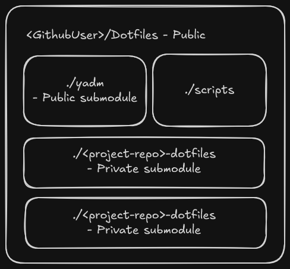

# DotFiles

This project is meant to make use of [YADM](https://yadm.io/), [git submodules](https://git-scm.com/book/en/v2/Git-Tools-Submodules), and [gpg](https://gnupg.org/) to create separate repositories (git submodules) which will encypt the sensitive data needed to run other projects. The dotfiles repository is meant to be included as a submodule on any of my projects which need secrets file storage.



The same way that GNU/stow will map files into ones `$HOME` directory, YADM will store and apply those files for each project in the same directory structure they are meant to be used in.

## Basic Usage

### Initializing on a new project

Simply add this repository as a submodule to your current project and run the initialize script!
If you are another user, change your remotes to point this to your own git repositories.

```bash
git submodule add <this-repositories-remote-url>
cd dotfiles
bash scripts/initialize.sh
```

Some expectations to take into consideration when running this:

1. Your default branch in github has been set to `master`
2. These scripts are meant to be ran from the `*/dotfiles` directory
3. `sudo` priveledges will be asked for to install gpg and jq when running the initialize script if not installed already

### On Clone/Initialization

### Adding files to storage

### Encryption/GPG

### Adding another project as a submodule

## Choice of using YADM

When researching different methods of storing dotfiles securely and in a manner which makes tracking and applying updates to the desired repositories easy, there were three main options. GNU/Stow, a cli tool included on most UNIX machines, dotdrop, a python package, and yadm, a cli tool with a little more flexibility than stow. All of these options use git as a storage mechanism for the files which are to be symlinked into place.

The stow's limitation of only being able to use `$HOME` as the root of the directory its symlinked files will be mapped to is what removed it from contention. For the most part the other options are nearly identical, using git as a backend, allow for templating files, integrations with git-crypt and gpg, and use of git submodules. What made YADM the tool of choice was the lack of additional dependencies (python and Pypi packages), a simpler more streamlined templating feature, and a reliance on git command syntax as opposed to custom commands and more configuration files.
