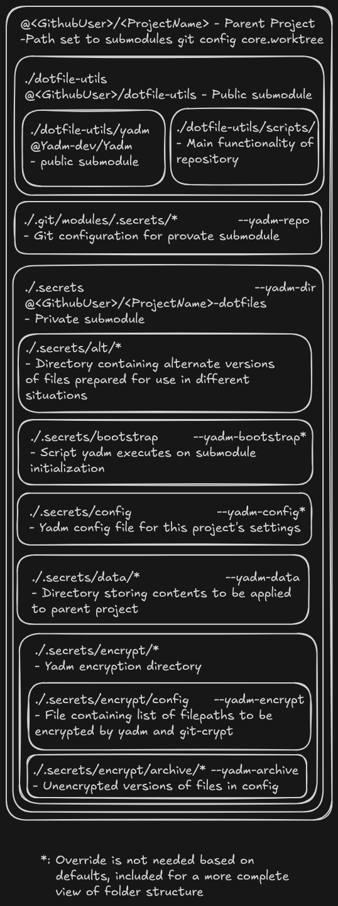

# Dotfile Utilities

This project provides a robust, self-contained utility for managing dotfiles and
other secrets across multiple machines. It uses [chezmoi](https://chezmoi.io/) as
its core engine and is designed to be included as a [git submodule](https://git-scm.com/book/en/v2/Git-Tools-Submodules)
in other projects.



A key feature is its resilient bootstrap process, which creates a personal mirror
of `chezmoi` to protect against upstream changes or outages.

## How It Works

The main `bootstrap.sh` script orchestrates the entire setup process. It leverages
the GitHub CLI (`gh`) to automatically to manage remote git assets:

1. **Ensure a Personal Fork**: It checks for a personal fork of the `twpayne/chezmoi`
repository on your GitHub account and creates one if it doesn't exist.
2. **Mirror Release Artifacts**: It checks for a specific, version-pinned release
on your personal fork. If the release is missing, it mirrors the official release
artifacts for multiple platforms (Linux, macOS, etc.) to your fork.
3. **Install from Mirror**: It installs the correct `chezmoi` binary for the local
system using the artifact from your personal, mirrored release.

This ensures the bootstrap process is not dependent on the original `chezmoi`
repository remaining available long-term.

## Prerequisites & Usage Notes

- `git` must be installed.
- SSH is the expected and configured method of authentication. A ssh key must be
generated and configured before using this tool.
- The GitHub CLI (`gh`) must be installed and authenticated.
    - The bootstrap script will attempt to install `gh` if it's missing, but you
    must authenticate it yourself by running:

  ```bash
  gh auth login
  ```

    - The token requires `repo`, `read:org`, `delete_repo`, and `admin:public_key`
    scopes to create, update, and delete forks, repos, commits, and releases.
- `sudo` privileges may be required for the script to install dependencies like
`gh`, `gpg`, and `jq`.
- These scripts are meant to be run from the root directory of the parent
project (the one that includes this repository as a submodule).

## Basic Usage

1. **Add as a Submodule**:
    Add this repository as a submodule to your project.

    ```bash
    git submodule add <this-repository-url> dotfile-utils
    ```

2. **Run the Bootstrap Script**:
    Execute the main bootstrap script. This is the only command you need to run
    to set up a new project or clone an existing one.

    ```bash
    chmod 754 -Rc ./dotfile-utils/bootstrap.sh 
    ./dotfile-utils/bootstrap.sh
    ```

    - If this is a new project, the script will prompt you to create a new secrets
    repository. This will create a submodule and a local `.chezmoi.toml` file to
    manage files within this project.
    - If this is an existing project, the script will initialize the secrets submodule
    and automatically apply the configuration using
    `chezmoi --config ./.chezmoi.toml apply`.

3. **Manage Your Dotfiles**:
    After the bootstrap is complete, your project is ready to go. You can use
    standard `chezmoi --config ./.chezmoi.toml` commands to manage your
    project's configuration files.

    ```bash
    # Add a new file to be managed
    chezmoi --config ./.chezmoi.toml add docker-compose.yml

    # Apply any pending changes
    chezmoi --config ./.chezmoi.toml apply
    ```

## Managing Dotfiles

### Adding a new file

To add a new file to be managed by `chezmoi`, you have two options:

#### Option 1: Use the helper script (recommended for project files)

The `chezmoi-add-secret.sh` script simplifies adding files from your project directory
to chezmoi. It handles the limitation where chezmoi won't add files from directories
it manages.

```bash
# Add a file
./dotfile-utils/scripts/chezmoi-add-secret.sh .env

# Add an encrypted file
./dotfile-utils/scripts/chezmoi-add-secret.sh --encrypt .env

# Show help
./dotfile-utils/scripts/chezmoi-add-secret.sh --help
```

The script will:

1. Copy the file to the chezmoi source directory with proper naming
   (e.g., `.env` → `dot_env`)
2. Add `encrypted_` prefix if `--encrypt` is used
   (e.g., `.env` → `encrypted_dot_env`)
3. Encrypt the file using GPG if encryption is enabled
4. Apply changes to deploy the file back
5. Stage the file in git for commit

#### Option 2: Use chezmoi directly

For files outside your project directory, use the standard `chezmoi add` command:

```bash
# Add a configuration file
chezmoi --config ./.chezmoi.toml add <filename>

# Add an encrypted file (requires GPG encryption to be configured)
chezmoi --config ./.chezmoi.toml add --encrypt <filename>
```

### Editing a file

Once a file is added, my preferred way of updating the contents of any file
is use whatever editor you prefer and then merge them into the chezmoi repo with
the command below.

```bash
# Retain Edits to a File
chezmoi --config ./.chezmoi.toml merge <filename>
chezmoi --config ./.chezmoi.toml git --  add <filename>
chezmoi --config ./.chezmoi.toml git --  commit -m "<message>"
chezmoi --config ./.chezmoi.toml git --  push
```

### List managed/unmanaged file paths

```bash
chezmoi --config ./.chezmoi.toml <managed|unmanaged>
```

### Ensure files are removed from other machines upon apply

```bash
# Add a path pattern to your .chezmoiremove file
chezmoi --config ./.chezmoi.toml cd
printf "\n%s" "<path-pattern>" >> ./.chezmoiremove
# Commit changes, push to other device, run `chezmoi apply`
# Can use ` --dry-run --verbose` flags to test this removal
```

### Add public ssh keys from github

```bash
# chezmoi can retrieve your public SSH keys from GitHub, which can be useful
# for populating your ~/.ssh/authorized_keys. Put
# the following in your ~/.local/share/chezmoi/dot_ssh/authorized_keys.tmpl:
{{ range gitHubKeys "$GITHUB_USERNAME" -}}
{{   .Key }}
{{ end -}}
```

### File and Directory name modifiers

> Directory targets are represented as directories in the source state. All other
target types are represented as files in the source state. Some state is encoded
in the source names.

*Taken from the [source attribute documentation for chezmoi](https://www.chezmoi.io/reference/source-state-attributes/). Follow these file and directory naming conventions to achieve desired results with chezmoi.*

### Set environment variables for use in `chezmoi apply`

You can set extra environment variables for your scripts, hooks, and commands in
the scriptEnv section of your config file. For example, to set the MY_VAR environment
variable to my_value, specify:

#### ~/.config/chezmoi/chezmoi.toml

```toml
[scriptEnv]
    MY_VAR = "my_value"
```

### Encryption with GPG

`chezmoi` has built-in support for transparently encrypting and decrypting files
using GPG. This is ideal for managing files with sensitive data, like shell history
or private keys.

#### Enabling Encryption During Bootstrap

When running the bootstrap script for a new project, you'll be prompted to enable
GPG encryption. You can also specify it via command-line flags:

```bash
# Enable encryption and let the script generate a new GPG key
./dotfile-utils/bootstrap.sh --encrypt

# Enable encryption with an existing GPG key
./dotfile-utils/bootstrap.sh --encrypt --gpg-key <KEY_ID>
```

If you enable encryption, the bootstrap script will:

1. Prompt you to either use an existing GPG key or generate a new one
2. Generate a new 4096-bit RSA key (if creating new) with predefined secure settings:
   - Key type: RSA
   - Key length: 4096 bits
   - No expiration (suitable for long-term project encryption)
   - No passphrase (for automated `chezmoi` operations)
   - Name format: `<project-name>-chezmoi@localhost`
3. Configure `.chezmoi.toml` with the GPG key ID for automatic encryption/decryption

#### Adding Encrypted Files

To encrypt a file, add it with the `--encrypt` flag:

```bash
chezmoi --config ./.chezmoi.toml add --encrypt ~/.private-key
```

When you run `chezmoi apply`, the file will be decrypted and placed in the correct
location. The encrypted version remains safely in your git repository.

#### Using Encryption in CI/CD Pipelines

To use encrypted chezmoi files in CI/CD environments, you need to export your GPG
key and configure it as a secret in your CI platform.

##### Export your GPG private key

```bash
# List your GPG keys to find the KEY_ID (shown in bootstrap output)
gpg --list-secret-keys --keyid-format LONG

# Export the private key (replace KEY_ID with your actual key ID)
gpg --export-secret-keys --armor <KEY_ID> > private-key.asc
```

##### Configure CI Secrets

Add these secrets to your CI platform (GitHub Actions, GitLab CI, etc.):

- `GPG_PRIVATE_KEY`: The contents of `private-key.asc`
- `GPG_KEY_ID`: Your GPG key ID (optional, for verification)

##### Import key in CI

```bash
# In your CI script (before running chezmoi apply)
echo "$GPG_PRIVATE_KEY" | gpg --import --batch --yes

# Verify the key was imported (optional)
gpg --list-secret-keys "$GPG_KEY_ID"

# Now you can run chezmoi apply
chezmoi --config ./.chezmoi.toml apply
```

##### Security Notes

- **Never commit the private key used to manage chezmoi encryption to git, all
  other private keys included should be themselves encrypted**
- Delete `private-key.asc` after adding it to CI secrets
- The generated keys have no passphrase for automation convenience, so protect
  the CI secrets carefully
- Consider using separate GPG keys for different environments (dev/staging/prod)

### WSL specific code within templates

```bash
{{ if eq .chezmoi.os "linux" }}
{{   if (.chezmoi.kernel.osrelease | lower | contains "microsoft") }}
# WSL-specific code
{{   end }}
{{ end }}
```

## Hardcoded Configurations

While this utility aims to be flexible, certain configurations are hardcoded
directly into the scripts for stability and simplicity. If you need to customize
these, you will need to edit the scripts directly.

### `scripts/add_project.sh`

- **Allowed Modes**: The list of operational modes (`local`, `testing`,
    `production`) that can be assigned to a new project is defined in the
    `ALLOWED_MODES` array.

    ```bash
    ALLOWED_MODES=("local" "testing" "production")
    ```

### `scripts/install_chezmoi.sh`

- **Chezmoi Version**: The specific version of `chezmoi` to install is pinned
    in the `CHEZMOI_VERSION` variable. This ensures a consistent and repeatable
    setup.

    ```bash
    CHEZMOI_VERSION="v2.63.0"
    ```

- **Installation Directory**: The `chezmoi` binary is installed into `~/.local/bin`
    by default. This is defined by the `INSTALL_DIR` variable.

    ```bash
    INSTALL_DIR="${HOME}/.local/bin"
    ```

- **Mirrored Platforms**: To support cross-platform usage, the script mirrors
    `chezmoi` release artifacts for a predefined set of operating systems and
    architectures. This list is defined in the `PLATFORMS_TO_MIRROR` array.

    ```bash
    PLATFORMS_TO_MIRROR=(
      "linux_amd64"
      "linux_arm64"
      "darwin_arm64"
    )
    ```

## Design Choices & Historical Context

When researching different methods of storing dotfiles, there were three main options:
GNU/Stow, dotdrop, and `yadm`. All use git as a storage mechanism for the files
which are to be symlinked into place.

Stow's limitation of not integrating with other tools directly removed it from contention.
An attempt was made to use `yadm`, as it had fewer dependencies (no Python) and
provideda simpler templating feature. However, this was not feasible as the git
config value in `core.worktree` was used by both `yadm` (for storing the path from
the parent module to thesubmodule to the parent module) and by `git submodule`
(to store the path from the parent module to the submodule), creating a conflict.

This issue led to the adoption of `chezmoi`. It provides the desired features like
templating and encryption without the conflicts encountered with other tools, and
its single-binary nature makes the resilient bootstrap process (forking and mirroring
release artifacts) possible.
