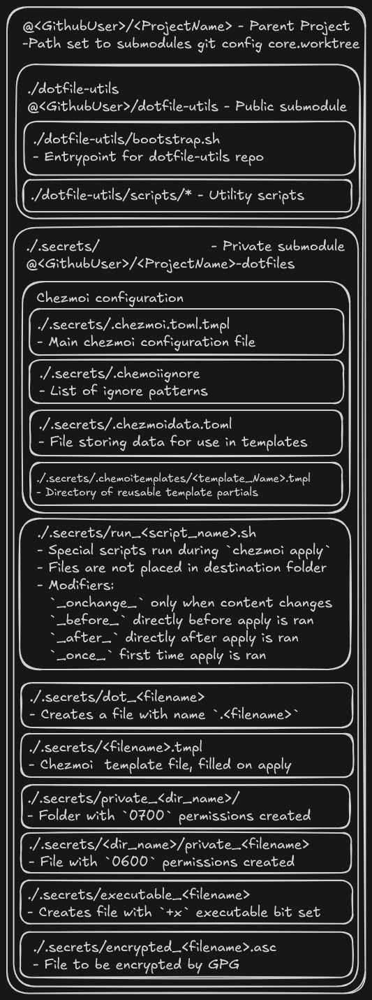

# Dotfile Utilities

This project provides a robust, self-contained utility for managing dotfiles and secrets across multiple machines. It uses [chezmoi](https://chezmoi.io/) as its core engine and is designed to be included as a [git submodule](https://git-scm.com/book/en/v2/Git-Tools-Submodules) in other projects.



A key feature is its resilient bootstrap process, which creates a personal mirror of `chezmoi` to protect against upstream changes or outages.

## How It Works

The main `bootstrap.sh` script orchestrates the entire setup process. It leverages the GitHub CLI (`gh`) to automatically:

1. **Ensure a Personal Fork**: It checks for a personal fork of the `twpayne/chezmoi` repository on your GitHub account and creates one if it doesn't exist.
2. **Mirror Release Artifacts**: It checks for a specific, version-pinned release on your personal fork. If the release is missing, it mirrors the official release artifacts for multiple platforms (Linux, macOS, etc.) to your fork.
3. **Install from Mirror**: It installs the correct `chezmoi` binary for the local system using the artifact from your personal, mirrored release.

This ensures the bootstrap process is not dependent on the original `chezmoi` repository remaining available long-term.

## Prerequisites & Usage Notes

- `git` must be installed.
- The GitHub CLI (`gh`) must be installed and authenticated. The bootstrap script will attempt to install `gh` if it's missing, but you must authenticate it yourself by running:

  ```bash
  gh auth login
  ```

  The token requires `repo` scope to create forks and releases.
- `sudo` privileges may be required for the script to install dependencies like `gh`, `gpg`, and `jq`.
- The bootstrap scripts are meant to be run from the root directory of the parent project (the one that includes this repository as a submodule).

## Basic Usage

1. **Add as a Submodule**:
    Add this repository as a submodule to your project.

    ```bash
    git submodule add <this-repository-url> dotfile-utils
    ```

2. **Run the Bootstrap Script**:
    Execute the main bootstrap script. This is the only command you need to run to set up a new project or clone an existing one.

    ```bash
    ./dotfile-utils/bootstrap.sh
    ```

    - If this is a new project, the script will prompt you to create a new secrets repository. This will create a submodule and a local `.chezmoi.toml` file to manage files within this project.
    - If this is an existing project, the script will initialize the secrets submodule and automatically apply the configuration using `chezmoi apply`.

3. **Manage Your Dotfiles**:
    After the bootstrap is complete, your project is ready to go. You can use standard `chezmoi` commands to manage your project's configuration files.

    ```bash
    # Add a new file to be managed
    chezmoi add docker-compose.yml

    # Apply any pending changes
    chezmoi apply
    ```

## Managing Dotfiles

### Adding a new file

To add a new file to be managed by `chezmoi`, use the `add` command. `chezmoi` will copy the file into its source directory, ready to be committed.

```bash
# Add a configuration file
chezmoi add <filename>
```

### Editing a file

Once a file is added, my recommended way of updating the contents of the file are to just make the updates with whatever editor you prefer and them merging them into the chezmoi repo with the command below.

```bash
# Retain Edits to a File
chezmoi merge <filename>
chezmoi git --  add <filename>
chezmoi git --  commit -m "<message>"
chezmoi git --  push
```

### List managed/unmanaged file paths

```bash
chezmoi <managed|unmanaged>
```

### Ensure files are removed from other machines upon apply

```bash
# Add a path pattern to your .chezmoiremove file
chezmoi cd
printf "\n%s" "<path-pattern>" >> ./.chezmoiremove
# Commit changes, push to other device, run `chezmoi apply`
# Can use ` --dry-run --verbose` flags to test this removal
```

### Add public ssh keys from github

```bash
# chezmoi can retrieve your public SSH keys from GitHub, which can be useful for populating your ~/.ssh/authorized_keys. Put the following in your ~/.local/share/chezmoi/dot_ssh/authorized_keys.tmpl:
{{ range gitHubKeys "$GITHUB_USERNAME" -}}
{{   .Key }}
{{ end -}}
```

### File and Directory name modifiers

> Directory targets are represented as directories in the source state. All other target types are represented as files in the source state. Some state is encoded in the source names.

*Taken from the [source attribute documentation for chezmoi](https://www.chezmoi.io/reference/source-state-attributes/). Follow these file and directory naming conventions to achieve desired results with chezmoi.*

### Set environment variables for use in `chezmoi apply`

You can set extra environment variables for your scripts, hooks, and commands in the scriptEnv section of your config file. For example, to set the MY_VAR environment variable to my_value, specify:

#### ~/.config/chezmoi/chezmoi.toml

```toml
[scriptEnv]
    MY_VAR = "my_value"
```

### Encryption with GPG

`chezmoi` has built-in support for transparently encrypting and decrypting files using GPG. This is ideal for managing files with sensitive data, like shell history or private keys.

To encrypt a file, add it with the `--encrypt` flag.

```bash
chezmoi add --encrypt ~/.private-key
```

When you run `chezmoi apply`, the file will be decrypted and placed in the correct location. The encrypted version remains safely in your git repository.

### WSL specific code within templates

```bash
{{ if eq .chezmoi.os "linux" }}
{{   if (.chezmoi.kernel.osrelease | lower | contains "microsoft") }}
# WSL-specific code
{{   end }}
{{ end }}
```

## Design Choices & Historical Context

When researching different methods of storing dotfiles, there were three main options: GNU/Stow, dotdrop, and `yadm`. All use git as a storage mechanism for the files which are to be symlinked into place.

Stow's limitation of not integrating with other tools directly removed it from contention. An attempt was made to use `yadm`, as it had fewer dependencies (no Python) and a simpler templating feature. However, this was not feasible as the git config value in `core.worktree` was used by both `yadm` (for storing the path from submodule to the parent module) and by `git submodule` (to store the path from the parent module to the submodule), creating a conflict.

This issue led to the adoption of `chezmoi`. It provides the desired features like templating and encryption without the conflicts encountered with other tools, and its single-binary nature makes the resilient bootstrap process (forking and mirroring release artifacts) possible.
